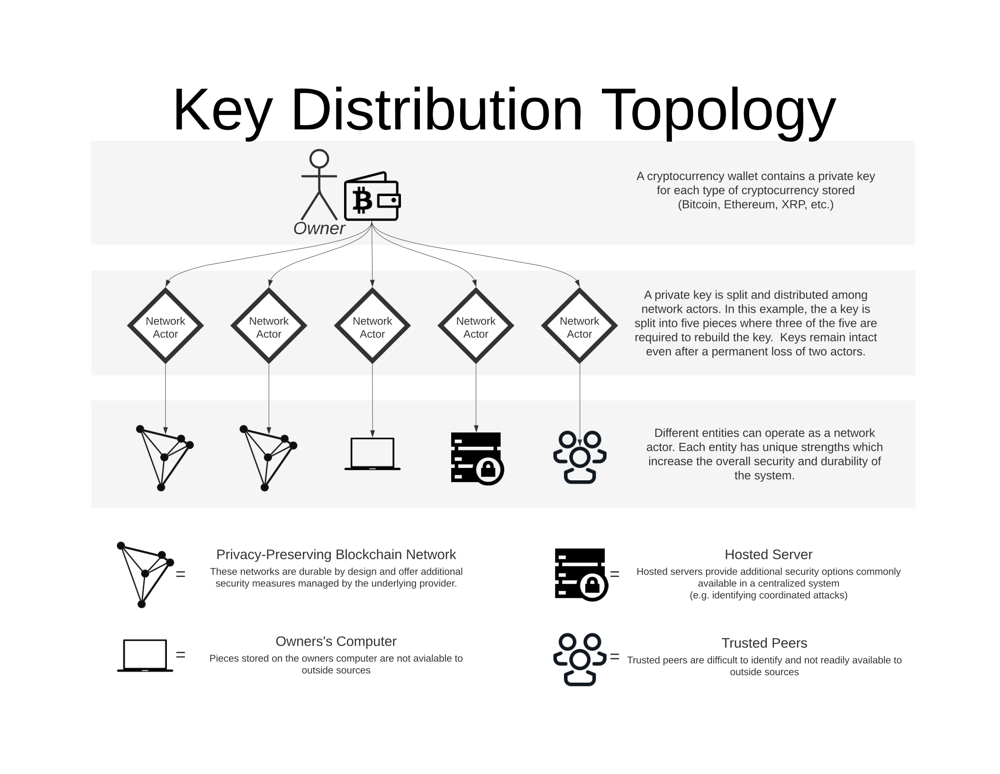

Gridlock Network

## A secure and private cryptocurrency storage service

[devs@gridlock.network](mailto:devs@gridlock.net)

V0.6 May 2020

### Abstract 

Gridlock Network is a distributed keystore using a variety of network devices for increased security. Private keys are split into shares using the full-threshold EDCSA signature scheme, an m of n signature scheme, with a minimum recommendation of 3 of 5 shares for a rebuild threshold. Key shares are distributed to network devices for storage and transaction signing. The primary device in the Gridlock Network is Enigma's Secret Network, which makes Gridlock a network of networks. Nodes on the Secret Network use Intel's trusted execution environments, called enclaves, to ensure secrecy of stored information. This insurance protects against collusion of participating nodes and increases availability due to share distribution across the entire Secret Network. Gridlock enhances this security and protects against side-channel attacks by distributing shares to non-Enigma devices to protect against the risk of broken enclaves. Additional devices include personal devices, trusted acquaintance devices, personal cloud devices,
and trusted key store services like Gridlock Watchlight.

## Overview

[Problem/Solution](#problem--solution) 

- Problem
- Solution

[Network Architecture](#network-architecture)

- Overview 
- Additional devices
- Key Generation

[User Experience](#user-experience) 

- Vault Generation
- Signing
- Account Recovery

[Advanced Features](#advanced-features)

- Multi-sig Accounts 
- One-way Asset Flow
- Asset Management
- Watchlight Service

[Conclusion](#conclusion) 

## Problem / Solution

### Problem

Cryptocurrency users have only two options when storing assets, either with a third-party cryptocurrency exchange or a personal cryptocurrency wallet. Both options have drawbacks in privacy, usability, and security, some of which can ultimately lead to a loss of all assets.

Exchanges are centralized entities with complete control over a user's funds and knowledge of the user's identities. Users are subject to arbitrary transaction delays and withheld assets based on the whim of the exchange. Furthermore, all assets are lost if an exchange is hacked[1], goes out of business, exit scams, or is otherwise shut down[2]. Many exchanges have shut down in one of these ways, which has led to the saying "Not your keys, not your coins". The saying promotes storing of assets in personal wallets outside the oversight of exchanges.

While crypto wallets give control back to the user, that control is a double-edged sword. Full control means a user is solely responsible for the management and security of their private keys. All assets vanish if a private key is lost or stolen. Most wallets do have backup mechanisms, namely mnemonic phrases, which allow users to recover lost keys. The problem here is the backup itself is still a single point of failure. If a user's mnemonic phrase is lost or stolen, all assets are unrecoverable. Crypto wallets are seriously lacking in usability.[3]

Other solutions like hardware wallets, smart contract wallets, or multi-sig wallets add value in one way or another, but all still have problems with security and usability.[4][5] The community needs a solution that doesn't sacrifice privacy in the name of usability or usability in the name of security. 

### Solution

Gridlock overcomes problems with security, usability, and privacy by distributing a user's private keys across multiple devices. 

Keys are split into key shares using the full-threshold ECDSA signature scheme, which requires a designated threshold of shares before the key is used. The initially recommended threshold is 3 of 5, meaning that 5 key shares are distributed, and 3 must come together to rebuild the key. Shares are distributed among participating network devices for storage. 

The primary tool for key storage is Enigma's Secret Network, making Gridlock a network of networks. Enigma's network ensures the secrecy of shares by mandating that nodes running the network use Intel’s trusted execution environments (TEE), also known as enclaves, for all computations and data storage. This feature encrypts all sensitive data, hiding it from everyone, including the node operator. This restriction allows for the availability benefits of multiple storage nodes and protects against the possibility of malicious node operators.

Enigma enclaves are potentially susceptible to side-channel attacks which can allow hackers or node operators to break the security of an enclave. The viability of these attacks is questionable outside an academic setting, given an appropriately coded protocol. Still, the potential of loss is too great to rely solely on an enclave to ensure the security of a private key. For additional security, secondary non-Enigma devices are necessary. 

Secondary network devices provide insurance against the possibility of cracked enclaves in Enigma's network. Additional devices include personal devices, trusted acquaintance devices, personal cloud devices, and trusted key store services like Gridlock Watchlight. The variety of each device increases network security by varying the attack surface, so a flaw in any area of the network does not cause a loss of assets. 

Gridlock vaults are highly usable since users are not required to manage their private keys. Instead, keys are distributed throughout the network, controlled by the user alone. To access a vault, owners provide a hashed identity and credentials. User identities are hashed and encrypted before storage which means no network device knows the identity of the vault owner. 

## Network Architecture

Key shares are distributed across multiple devices to gain the security benefits of each. The [key share topology document ](https://github.com/GridlockNetwork/Resources/blob/master/documentation/Gridlock%20-%20Key%20Distribution%20Topology.pdf)shows a default 3-of-5 key share distribution. 

### Primary device(s)

Enigma's privacy-preserving network is the primary share store option in Gridlock's network due to its high availability and usage of secure SGX enclaves. We plan to use this network to store multiple key shares, as long as the network does not control a majority of shares. This strategy allows Gridlock to leverage the strength of a privacy-preserving network while removing the risks associated with compromised SGX enclaves.

### Additional devices

##### Personal Device

Gridlock uses a client-side application for wallet generation and usage. The application is also a storage participant and can encrypt and store a share of the private key. Users can add more devices of the same type with additional personal devices or hardware-based key storage devices. 

##### Personal Cloud Device

Microservers and microservices allow users to store personal data on a cloud server. These servers are affordable, always online, and always in the owner's control. Gridlock aims to work with cloud providers to make the creation of these devices as easy as a click of a button. 

##### Acquaintance device

One or more trusted acquaintances can store a key share using the client-side application with minimal effort. The storage and use of a share do not require any input from the acquaintance beyond the initial acceptance. For transaction signing, the device must be online to provide their share of the signature; therefore the use of acquaintance devices is limited to half of the total participating devices, m-1, to ensure constant availability. 

##### Trusted service

A trusted key store service, like Gridlock Watchlight, can store a key share and provide additional protection not available in other "passive" storage options. This option adds benefits of modern FinTech security practices, like suspicious transactions, without the ultimate control of a full key store service. 

## User Experience

### Vault Generation

New users generate a Gridlock vault by creating an "account" with Gridlock and defining an identity and log-in credentials. The identity consists of non-private information, such as full name and government ID, and access credentials, which are a combination of password, 2FA, biometrics, etc. This information is required so decentralized devices can uniquely identify the user. All information is encrypted client-side, so the identity of the user remains secret. 

Once the user has created a vault, they can generate addresses for each cryptocurrency they wish to store. 

### Funds Transfer and Transaction Signing

Users transfer funds into the network by sending their assets to the crypto addresses provided by Gridlock.

To transfer funds out of the network or sign transactions, users must authenticate with each network device and request the device's portion of the signature. However, this work is done without user interaction. All the user has to do is confirm their identity and access credentials and transmit that information along with the transaction they wish to perform. 

### Account Recovery

Traditional account recovery mechanisms often require that users give up their privacy and autonomy to a central authority. Gridlock Network aims to solve that problem with the first truly decentralized system.

However, there are struggles with this goal, particularly when it comes to account recovery. Since there is no central authority to fall back on, we must consider how to best walk the line between security and usability. We feel we've solved this problem by introducing the concept of *fading security*. 

Fading security is the process in which the credentials required to access a vault are systematically reduced until access is re-established. If something goes wrong and a user cannot access their vault, they only have to wait until the fading security mechanism catches up to a point where they can re-establish access. This can be inconvenient at times, but we feel this is an easy trade-off to gain perfect security and complete control.

## Technical Process flow

### Vault Generation

The user provides multiple pieces of identification information (i1, i2... in), such as name and a government ID, and credential information (c1, c2... cn), such as password and either a 2FA or a biometric key. Using the provided information, Gridlock will construct a custom Merkle tree combining each element. This allows us to generate password tiers used by the fading security engine (see below). 

Prior to transmittal, each data element is hashed client-side using Argon2d with a moderately large number of iterations. The assumption is that crypto transactions are not extremely common, so a multi-second wait is a fair trade-off for increased protection against brute-force attacks. Additionally, the finality time of many blockchains makes the extended client-side delay negligible (i.e. a three-second wait for a Bitcoin transaction, which takes an average of 10 minutes to finalize). 

We will create n sets of hashed credentials for each participating device to create unique hashed sets for each participant. Aragon2 automatically provides a unique salt per hash. This allows us to protect against user impersonation between devices. In other words, the H(c1) on one device will not match H(c1) on another device. Compromised devices cannot coerce additional key shares using their hashed credentials. 

### Key Generation

Distributed key generation ensures that the private keys are never fully available, which eliminates problems with potentially compromised nodes. TSS requires multiple rounds of communication between participating devices to generate a private key; the amount of communication required depends on the number of participants. 

Before user interaction, private-public keypairs are generated for all supported coins, reducing the vault generation time for new users. Keys are stored in the system and available for user association once a user account is created. 

### Transaction Signing

There are two proposed states for transaction signing based on the maturity of the network. The first state incorporates a central communication hub, which significantly reduces many parts of the architecture. 

Note: The decision to include a central point of communication was not made lightly as it goes against the ethos of the blockchain community. With the understanding that a central communication-only hub *does not affect the security of the product*, we decided to incorporate this in the initial release while we stabilize the rest of the network. 

With this architecture, funds transfer and transaction signing occur as follows:

1) The user transmits one packet of transaction information to the communication hub for each participating storage device. Each packet contains the user's identity, credentials, and transactiom information and is encrypted with the public key of the target storage device. The communication hub cannot access the contents of the packet and exists only to forward to the target storage device.

2) Each storage device validates the user's credentials. If accepted, it returns their portion of the signed transaction back to the communication hub. 

3) The communication hub combines all signature pieces and transmits the complete signed transaction to the correct blockchain network. 

The second state is much like the first, except it eliminates the communication hub. 

With this architecture, funds transfer and transaction signing occur as follows:

1) The user transmits one packet of transactiom information for each participating storage device to *any* participating storage device. The first contacted device becomes the 'primary device' and is responsible for communication between other participants, as well as transaction signing. The primary device forwards transaction packets to their designated participants. 

2) Each storage device validates the user's credentials. If accepted, it returns their portion of the signed transaction back to the primary device. 

3) The primary device combines all signature pieces and transmits the complete signed transaction to the correct blockchain network. 

### Fading Security

Fading security ensures guaranteed access to the user's vault without centralized oversight. This is possible by reducing the requirements for access after a pre-determined time window has elapsed without the user making a connection. 

The following example shows how the security engine might reduce access requirements based on an arbitrary number of security elements or "checks". The system is designed to give precedence to stronger access credentials.

<code>G</code> = **G**uardians		 	 <code>D</code> = **D**evice (2FA)	            <code>P</code> = **P**assword

<code>B</code> = **B**iometric key		<code>A</code> = Sum of **A**ny checks	<code>C</code> = Total number of **C**hecks

<code>T</code> = number of **T**ime windows elapsed without access

The engine iterates through the defined logic whenever a user requests access. The system starts at a time window <code>T</code> of 0 and increments by 1 for each time new window without a successful connection. Once a connection is established, <code>t</code> is reset to 0. 

**Tier 1 :** If <code>C</code> - <code>T</code> - 2 = 0 -> evaluate credentials and grant access if <code>C</code> - <code>T</code> - 2 = <code>B</code> + <code>P</code> + <code>A</code>

**Tier 2:** If <code>C</code> - <code>T</code> - 1 = 0 -> evaluate credentials and grant access if <code>C</code> - <code>T</code> - 1 = (<code>B</code> or <code>P</code>) + <code>A</code>

**Tier 3:** If <code>C</code> - <code>T</code> = 0 -> evaluate credentials and grant access if <code>C</code> - <code>T</code> = <code>A</code> AND <code>A</code> > 0

**Tier 3a:** If  <code>C</code> - <code>T</code> = 0 AND <code>A</code> > 0  -> grant access if based on user identity only as long as the requestor put up ~$1 worth of cryptocurrency as collateral. This helps stop network "scanning" looking for open accounts.

**Tier 5:** Transfer funds to pre-defined Guardian

### Attack Vectors

Although we’ve gone to great lengths to ensure architectural security, a system is only as safe as its known attack vectors. 

1. Communication Hub Takeover - As a centralized system, the communicatio hub is vulnerable to take over in a traditional sense. This risk is mitigated by ensuring the router has minimal view into the encrypted packets its routing.
2. Threshold Signature Attacks - are there any known TSS attacks? need to research.
3. Stealing a users credentials - secured by 2FA along with signature request processs from nodes.
4. Side-channel attacks on SGX[3].

### Full-threshold ECDSA

The Gridlock Vault will utilize a full-threshold ECDSA. Elliptic Curve Digital Signature Algorithm(ECDSA) is a standardized signing algorithm that is used in Transport Layer Securty(TLS), code signing, cryptocurrency and more.  Full-threshold means that any t-out-of-n parties can sign a message thus this protocol would allow distributed signing and key-generation with any t <= n. Securely computing ECDSA in a distributed manner, t-out-of-n threshold signing, is needed for protecting of the private key. By splitting the secret key between multiple devices it avoids that the storage of the secret key becomes the single point of failure because no single device or party has access to the full private key. T-out-of-n Threshold Signatures ensures that any t+1 of the devices that store a share of the private key can jointly sign any given message but no t colluding parties can forge a signature at all. 

For more details on full-threshold ECDSA for distributed key generation and signing the reader is referred to the paper by Lindell et al[1].

### Intel’s SGX

The Secret Network is solving the major issues of privacy and scalability currently impacting available public blockchains and decentralized application (dApp) platforms. The network leverages Intel's latest Trusted execution environments(TEE), Intel's Software Guard Extensions(SGX), technology to protect data while still allowing for computation over the data. Intel's SGX enables the execution of security-critical application code, called enclaves, in isolation from the untrustedsystem  software. The SGX reduces the attack surface significantly(App + Processor) and offers a scalable security solution in a mainstream enviroment. The SGX architecture is especially useful in cloud computing applications, since  data  and  computation  can  be  outsourced  to  an  external  computing  infrastructure  without having to fully trust the cloud provider and the entire software stack

For more details on Intel's SGX the reader is refered to read [2] or visit [Intel's website](https://software.intel.com/content/www/us/en/develop/topics/software-guard-extensions.html).

## Advanced Features

### Multi-signature Accounts

Multi-signature accounts are as simple as supporting two or more identities with the same vault. Once added, future transactions require a defined subset of identities before a transaction is signed. The default is `n of n` identities but can be changed if approved by all parties. This option provides all the benefits of multi-sign authorizations without the weight of heavy multi-sig signatures on the blockchain. Since the approval logic is off-chain, the user can define granular logic beyond the standard yes-no logic in a multi-sig vault. 

Vaults can also store metadata to document the identities that authorized each transaction. The information is stored within the vault. This information allows users to keep an audit trail while maintaining on-chain privacy. 

### One-way asset flow

Periodic rotating of private keys is important to increase system security. This rotation reduces the time-window in which an attacker can obtain a private key. An attacker must compromise each device, storing a key share before the private key is changed. TSS-based wallets can rotate key shares to generate a different set of key shares while retaining the original public key. This mechanism is useful when users want to retain the public key for long-term use, but the typical user does not require this benefit.

It is, therefore, possible to have a public key for receiving funds only and a separate public key for sending funds. Put another way, all funds entering the system are not restricted to the public key used to import funds. Gridlock can freely rotate funds throughout the network as long as the user can track and transfer funds when desired. This rotation has enormous privacy benefits as the system becomes a mixer by default. 

### Asset Management

Gridlock Network is effectively non-custodial since no entity has control of stored funds. The only person able to access and control the funds is the owner. However, the system can include a permissions framework that allows for assignment of granular permissions to specified services. Asset owners can define which services have access to funds and for what reason. For example, the owner can determine which services have access for investment purposes. This granular level of control allows for a marketplace of services that benefit both the user and the service provider. The inclusion of explicit permissions helps assuage consumer fears when considering new services. 

### Watchlight Service

Gridlock Watchlight is an optional add-on service that provides oversight protection for vault owners. The service does not have the ultimate control of a user’s funds. Instead, it can closely monitor connected vaults and activity. This key share storage service adds the benefit of professional monitoring, which watches for suspicious transactions or coordinated attacks. This type of oversight is difficult with the standard distributed devices. If Watchlight identifies any suspicious activity, we can proactively notify the owner. This service bridges the gap between privacy and proactive monitoring. 

## Conclusion

Gridlock Network is the first truly secure and private cryptocurrency storage solution. Threshold Signatures combined with Trusted Execution Environments provide unparalleled security and availability, beyond any other solution available today. The offloading of complex key management eliminates one of the biggest barriers to mainstream crypto adoption. The elimination of a central authority vastly increases security and maintains a user’s privacy. 

## References 
[1] [List of cryptocurrency exchange hacks](https://selfkey.org/list-of-cryptocurrency-exchange-hacks/)

[2] [Mt Gox](https://www.wired.com/2014/03/bitcoin-exchange/)

[3] [Usability issues cryptocurrency wallets](https://www.researchgate.net/profile/Md_Sadek_Ferdous/publication/340630209_Examining_Usability_Issues_in_Blockchain-Based_Cryptocurrency_Wallets/links/5e95e00f92851c2f529f6e2c/Examining-Usability-Issues-in-Blockchain-Based-Cryptocurrency-Wallets.pdf)

[4] [Breaking Bitcoin Hardware Wallets](https://media.defcon.org/DEF%20CON%2025/DEF%20CON%2025%20presentations/DEF%20CON%2025%20-%20Datko-and-Quartier-Breaking-Bitcoin-Hardware-Wallets.pdf)

[5] [Multisig hack](https://loess.ru/pdf/2017-07-20_14.33.01%20https_blog.zeppelin.solutions_on-the-parity-wallet-multisig-hack-405a8c1.pdf)

[6]

[] [Fast Secure Multiparty ECDSA with Practical Distributed KeyGeneration and Applications to Cryptocurrency Custody](https://dl.acm.org/doi/pdf/10.1145/3243734.3243788)

[] [Intel SGX Product brief 2019](https://software.intel.com/content/dam/develop/public/us/en/documents/intel-sgx-product-brief-2019.pdf)

[] [The Security of Intel SGX for Key Protection andData Privacy Applications](https://cdn2.hubspot.net/hubfs/1761386/Unbound_Docs_/security-of-intelsgx-key-protection-data-privacy-apps.pdf)
